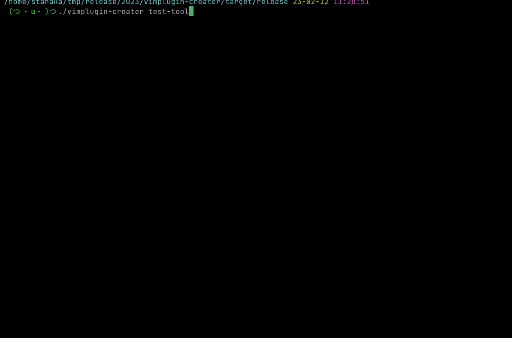

# vimplugindir-creater
    
A tool to automatically create vim and nvim plugin directories.

# Requirement
・cargo version 1.50.0+   
・rustc version 1.50.0+

# Installation
Set the local variable $VIMPLUGINDIR to the Vim plugin directory or the local variable $NVIMPLUGINDIR to the Neovim plugin directory.   
For example:
```
export VIMPLUGINDIR='~/.vim/pack/plugins/start/'
```
or
```
exprot NVIMPLUGINDIR='~/.config/nvim/plugins/'
```

Download:
```
git clone https://github.com/jacoloves/vimplugindir-creater.git
cd vimplugindir-creater
cargo build --release && cd ./target/release
./vimplugindir-creater [your-VimorNeovim-repository]
```
or
```
git clone https://github.com/jacoloves/vimplugindir-creater.git
cd vimplugindir-creater
cargo run -- [your-VimorNeovim-repository]
```

# Usage
```
vimplugindir-creater [your-VimorNeovim-repository]
```


```
tree
.
└── test-tool
    ├── autoload
    ├── doc
    └── plugin

4 directories, 0 files
```
# License
Distributed under MIT License. See LICENSE.
